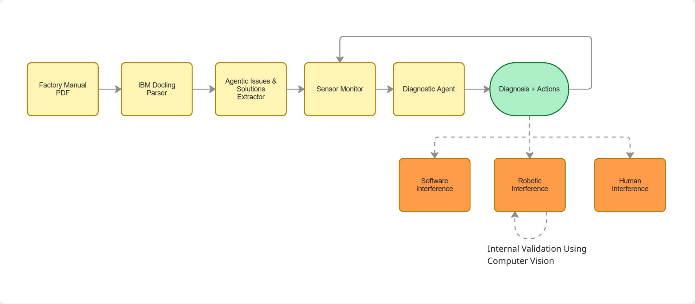

# DocRun

**Document-to-Executable Factory Intelligence with Physical AI**

DocRun takes factory maintenance manuals and makes them executable. Upload a PDF, the system extracts troubleshooting knowledge using Docling + Gemini, then continuously monitors sensors and diagnoses faults, with solutions and actions pulled directly from the document.

When a physical obstruction is detected, DocRun verifies it with an Intel RealSense depth camera and deploys a robotic arm (LeRobot SO101) to clear it, closing the loop from diagnosis to automated resolution.

Update the doc, update the diagnosis. No retraining, no hardcoded rules.

## System Flow



Factory Manual PDF → IBM Docling Parser → Agentic Issues & Solutions Extractor → Sensor Monitor → Diagnostic Agent → **Diagnosis + Actions** → Software Interference | Robotic Interference (with camera verification) | Human Interference

## Architecture

| Component | Description |
|---|---|
| `backend/pipeline/docling_parser.py` | Docling PDF parsing (OCR off, high-res table mode) |
| `backend/pipeline/gemini_extractor.py` | Gemini extracts fault table + thresholds + actions from parsed doc |
| `backend/pipeline/diagnostic_agent.py` | Gemini reasons across all sensors to diagnose faults |
| `backend/pipeline/sensor_monitor.py` | Sensor readings with injectable fault scenarios |
| `backend/pipeline/serial_reader.py` | Arduino serial reader (temperature, humidity via USB) |
| `backend/pipeline/camera_detector.py` | RealSense depth camera obstacle detection (depth + color filtering) |
| `backend/pipeline/gemini_client.py` | Shared Gemini client with rate limit retry |
| `backend/pipeline/schemas.py` | Pydantic models for all data structures |
| `backend/main.py` | FastAPI app with REST + WebSocket endpoints |
| `frontend/` | Single-page dashboard (vanilla JS) |

## Hardware

| Device | Purpose | Connection |
|---|---|---|
| Arduino Micro | Temperature + humidity sensors | USB serial (`/dev/ttyACM*`) |
| Intel RealSense D455f | Depth camera for obstacle detection | USB |
| LeRobot SO101 Follower | Robotic arm for physical actions | USB serial (`/dev/ttyACM*`) |

All hardware is optional — the system runs with simulated sensors if no hardware is connected.

## Setup

### Prerequisites

- Python 3.11+
- [uv](https://docs.astral.sh/uv/) package manager
- Gemini API key ([get one here](https://aistudio.google.com/apikey))

### Install

```bash
# Clone the repo
git clone git@github.com:viktor-ece/DocRun.git
cd physical_ai_hackathon

# Create .env with your Gemini API key
echo "GEMINI_API_KEY=your_key_here" > .env

# Optional: set Arduino serial port
# echo "SERIAL_PORT=/dev/ttyACM1" >> .env

# Install dependencies
uv sync

# Optional: install camera dependencies (requires RealSense SDK)
pip install pyrealsense2 opencv-python-headless
```

### Run

```bash
# Start the server
uv run uvicorn backend.main:app --reload --host 0.0.0.0 --port 8000
```

Open `http://localhost:8000` in your browser.

## API Endpoints

| Method | Endpoint | Description |
|---|---|---|
| `POST` | `/api/parse` | Upload PDF, parse with Docling, extract fault table |
| `GET` | `/api/fault-table` | Get currently loaded fault table |
| `GET` | `/api/sensors` | Current sensor snapshot |
| `GET` | `/api/scenarios` | Available fault injection scenarios |
| `POST` | `/api/sensors/inject?scenario=<name>` | Inject a fault scenario (demo) |
| `DELETE` | `/api/sensors/inject` | Clear injected faults |
| `POST` | `/api/diagnose` | Run one diagnostic pass |
| `POST` | `/api/camera/scan` | Capture RealSense frame, detect obstacles |
| `POST` | `/api/robot-action` | Deploy robot arm |
| `GET` | `/api/robot-status` | Robot arm execution status |
| `GET` | `/api/usage` | Gemini API usage stats |
| `WS` | `/ws/monitor` | Continuous monitoring (sensors + diagnosis) |

### Quick Demo

```bash
# 1. Parse a manual
curl -X POST "http://localhost:8000/api/parse" -F "file=@your_manual.pdf"

# 2. Inject a fault
curl -X POST "http://localhost:8000/api/sensors/inject?scenario=high_power"

# 3. Run diagnosis
curl -X POST http://localhost:8000/api/diagnose

# 4. Clear fault
curl -X DELETE http://localhost:8000/api/sensors/inject
```

## Output Files

After running, check the `output/` folder:

| File | Contents |
|---|---|
| `parsed_markdown.md` | Raw markdown Docling extracted from the PDF |
| `fault_table.json` | Structured fault table with thresholds, sensor hints, actions |
| `diagnosis_YYYYMMDD_HHMMSS.json` | Each diagnosis result with sensor readings + reasoning |

## Tech Stack

- **Docling** — IBM document parsing (PDF tables, structure extraction)
- **Gemini Flash** — fault extraction + diagnostic reasoning
- **FastAPI** — REST API + WebSocket
- **Pydantic** — data validation and schemas
- **Intel RealSense** — depth camera obstacle detection (pyrealsense2 + OpenCV)
- **LeRobot** — robotic arm replay for physical actions
- **Arduino** — real-time temperature + humidity sensors

## Team

Built for the Physical AI Hackathon by the Jason Team.
